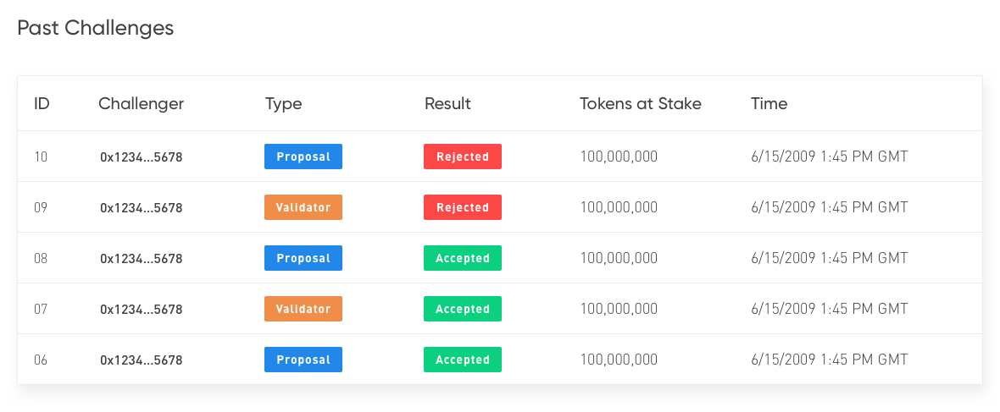

# Portal specification: `Governance`

The repository is home to the specification for the Kosu governance portal, primarily an interface for the `ValidatorRegistry` contract (a modified token-curated registry).

The repository contains the master `governance.sketch` file with the full UI/UX designs, and this README contains annotations of those designs and descriptions of each important state.

A custom helper library (`gov-portal-helper`) has been created to assist with the creation of this portal. Documentation for this library is found in the [documentation](#documentation) section.

# Background

Conceptually helpful topics and other background info required to work with this project. This document assumes familiarity with basic Ethereum concepts such as contracts, signatures, transactions, `web3.js`, providers, and MetaMask.

## Token curated registry

This governance portal is primarily an interface for a [token curated registry](https://medium.com/@ilovebagels/token-curated-registries-1-0-61a232f8dac7) (TCR), a type of Ethereum contract system designed to generate an arbitrary list of data by rewarding token-holders for curating its contents.

Paradigm's TCR curates a set of validators who run the Kosu network. Any entity may apply to the registry (create a "proposal"), where after a confirmation period they are accepted into the registry as a validator, so long as they have not been challenged. Applicants submit "stake" with the proposals, an amount of tokens they include with their proposal to indicate their seriousness of intent to join. At any point (even after the confirmation period) their listing may be "challenged", when another entity puts up an equal amount of stake to trigger a vote.

The resulting vote on the challenge ends either with the challenge passing, in which case the listing owner is removed from the registry and has their tokens distributed to the challenger and winning voters, or the challenge fails, in which case the listing remains and the challengers tokens are distributed to the listing owner and the winning voters.

## Vocabulary

- **Registry:** the TCR, specifically the Kosu `ValidatorRegistry` contract and the set of listings currently in the registry
- **Listing:** a non-specific term for any entity in the registry, either a _validator_ (confirmed) or a _proposal_ (pending, yet to be confirmed).
- **Proposal:** a new listing in the registry; a pending application to be a validator that is automatically confirmed after a period of time without being challenged.
- **Validator:** not only an actual validator on the proof-of-stake Kosu network, but more commonly in this context refers to a listing that has been confirmed to the registry.
- **Challenge:** an active poll against a listing (either a _proposal_ or a _challenge_) initiated by a token holder. A challenge resolves after a commit-reveal vote period, and results in distribution of the loser's (either the _challenger_ or the _listing_) stake to the winning voters and stakeholder (the _listing_ in the case of a failed challenge, or the _challenger_ in the case of a successful challenge).
- **Challenger:** an entity who has initiated a challenge against a _proposal_ or a _validator_ listing (note that a challenger who's challenge fails looses their staked tokens to the winning voters and the listing owner).
- **Voter:** an entity who is participating in a _challenge_ vote by committing their own tokens to one side of the poll (note, a voter may never loose their tokens if they vote on the losing side, they can only benefit if they win).
- **Stake:** a term used to describe A) an amount of tokens that may be lost in certain outcomes, or B) the act of committing tokens into a _staked_ position.
- **ValidatorRegistry:** the specific Ethereum contract that implements the functionality of this governance system within the greater Kosu protocol.

## Governance portal helper state/event model

The [`gov-portal-helper`](#documentation) library contains a single class, `Gov`, which manages and abstracts most functionality needed to interact with the Kosu system.

The three main properties listed below (and in more detail in the [documentation](#documentation) section) should be used for the main page (discussed below) that lists "proposals", "validators", and "challenges". These objects may be directly read from the `Gov` prototype, loaded via prototype methods, or queried each time a `gov_update` event is emitted from the `gov.ee` event-emitter object.

A `Gov` instance contains the following properties, which track the primary state of the portal system.

- [`gov.validators`](#Gov+currentValidators) - a map of Tendermint public keys (as hex-encoded strings) to [`Validator`](#validator) objects, with one entry for each current validator within the registry.
- [`gov.proposals`](#Gov+currentProposals) - a map of Tendermint public keys (as hex-encoded strings) to [`Proposal`](#proposal) objects, with one entry for each current pending proposal within the registry.
- [`gov.challenges`](#Gov+currentChallenges) - a map of Tendermint public keys (as hex-encoded strings) to [`StoreChallenge`](#StoreChallenge) objects, with one entry for listing that is currently being challenged.

All three properties above are loaded from the current contract system state when `gov.init()` is called, and further updated each time the contract system's state changes. After main page load, the `gov_update` event can be used to detect updates to the above state fields.

## Reliance on MetaMask

All sateful data (challenges, proposals, validators, past challenges, etc.) for the governance portal is loaded from the Ethereum blockchain, through the MetaMask extension which provides access to a remote Ethereum node.

As such, _this portal is useless without MetaMask,_ and MetaMask must be connected (via a call to `ethereum.enable()`) prior to any data being displayed. The actual call to `ethereum.enable()` is handled by initialization of a `Gov` instance (described below).

This brings up a few points to note:

1. Not having MetaMask installed should be treated as an error state, with a special page prompting the user to install the extension, or otherwise use a web3 browser.
1. On or just after page load, the `Gov` instance should be created. A call to [`gov.init()`](#govinit) handles the MetaMask connection, and prompts the user to grant site access. _The `gov.init()` call should not be made automatically,_ but instead should be triggered by the user clicking "connect to MetaMask" in the top nav bar.
1. Browser compatibility should also be handled. The only supported browsers are Chrome and Brave, unless a `window.ethereum` object is detected, in which case it can be assumed to be a compatible dApp browser.

_More details on `gov` initialization are included in the description and documentation sections._

## Units: wei vs. ether

Most token values (stake size, reward rate, etc.) are showed in "base units" of the token, which are also refereed to as `wei`, the smallest unit of most ERC-20 tokens. Becuase wei amounts will have between ~17-23 digits, amounts should be converted to ether prior to being displayed to the user.

A `gov` instance provides [`gov.weiToEther(wei)`](#govweitoetherwei--string) to convert from wei, and [`gov.etherToWei(ether)`](#govethertoweiether--string) to convert the other direction.

_These values are returned as strings, and should be converted to `BigNumber` instances where necessary. The static method `Gov.BigNumber` may be used to create new `BigNumber` instances from strings._

_Also note that "Ether" (proper noun) refers to the Ether cryptocurrency of the Ethereum network, while "ether" (lowercase) refers to the unit of 1\*10^18 wei._

# Description

This section contains the "meat" of the specification, with diagrams from [the sketch file](./governance.sketch) and annotations

## Main page (pre-MetaMask connection)

 <!-- https://sketch.cloud/s/VvZQ8/a/R4ZbmW -->

- This is the home/index page of the governance portal, which should be displayed prior to MetaMask connection
- The "Connect to MetaMask" button in the top-right nav-bar should trigger a call to [`gov.init()`](#govinit) which will prompt the user to allow the site access to their MetaMask `coinbase` account.
- Various exceptions (as promise rejections) from `gov.init()` indicate various failure states:
  ```javascript
  // init life-cycle (example only)
  (async () => {
    const gov = new Gov();
    try {
      await gov.init();
    } catch (error) {
      switch (error.message) {
        case "user denied site access":
          /* user clicked "reject" on MM prompt */
          break;
        case "non-ethereum browser detected":
          /* incompatible browser */
          break;
        default: {
          /* normal failure case, something unexpected went wrong */
        }
      }
    }
  })();
  ```

## Main page (post-MetaMask connection)

_The screenshots in this section are cropped from the same overview state, found [here](./images/gov-connected-main.png)._

 <!-- https://sketch.cloud/s/VvZQ8/a/j0dowG -->

- After a successful (no exceptions) call to [`gov.init()`](#govinit), data for the main page can be loaded.
  - This call should be triggered by the user clicking "connect to MetaMask".
- The users balance of KOSU tokens should be displayed in the top-right nav par, next to their address.
  - The user's address is stored as `gov.coinbase` (after `init` has completed).
  - The user's Kosu balance can be loaded (as a `BigNumber`, units of wei) with the following code:
    ```javascript
    // the following requires `gov.init()` to have completed successfully
    const coinbase = gov.coinbase;
    const balance = await gov.kosu.kosuToken.balanceOf(coinbase);
    ```
- After initialization, the `gov` instance will begin to load validators, challenges, and proposals, into its state.
- Each time a new proposal, challenge, or validator is loaded, the `gov_update` event will be emitted from `gov.ee`.
- The raw map (object) for each of the following sub-sections can then be loaded from the `gov` instance.

### Active proposals

 <!-- https://sketch.cloud/s/VvZQ8/a/j0dowG -->

- **Active proposals** should be loaded from `gov.proposals` (either by directly viewing that object, or a call to [`gov.currentProposals()`](#govcurrentproposals--mapproposal)).
  - Be sure to see the [`Proposal` type definition](#proposal) as well, which defines each object in the `gov.proposals` map.
  - Proposals on the main page display several values, which can be loaded (or computed) from each proposal object.
  - The titular hex string for each proposal card should be the key for the proposal in the `gov.proposals` object. This value is the public key for the listing application, encoded as a hex string.
  - The "new proposal" or "ending soon" badges should be displayed based on the `proposal.acceptUnix` field:
    - If `acceptUnix` is within one day of the current timestamp, "ending soon" should be displayed on the listing.
    - If `acceptUnix` is more than one week in the future, "new proposal" should be displayed on the listing.
    - If `acceptUnix` is less than a week in the future, but more than a day, no badge should be displayed.
  - The title for a proposal is "`X` wants to become a validator," and the `X` should be replaced with a shortened hex-string of the `proposal.owner` Ethereum address (`0x23ba...d2f`, for example).
    - Note that this hex string is 20 bytes (an Ethereum address, 42 chars with the "0x" prefix) and the listing key is a 32 byte (66 char with the "0x" prefix) Tendermint public key.
    - That is to say `proposal.owner` strictly is NOT EQUAL to the key of the object within the mapping.
  - The "Stake size" field should be loaded from `proposal.stakeSize`, and should be converted to units of ether prior to being displayed.
  - The "Daily reward" field should be loaded from `proposal.dailyReward` and should be converted to units of ether period to being displayed. Decimals can be truncated after 6-8 significant digits.
  - The "Estimated vote power" field should be loaded from `proposal.power`, which is a decimal number from 0-100 indicating a percentage of network vote power. The decimals can be truncated after a few significant digits, based on aesthetics/spacing.
  - The "Proposal ends in:" field must be computed based on the `proposal.acceptUnix` field, which indicates the Unix timestamp at which the proposal is confirmed. I recommend constructing a `Date` object from the timestamp, and using its methods to compute days, hours, and minutes. Seconds should not be shown, as the timestamp is purely an estimate.
  - The "View" button should take the user to the detail page for the proposal (detailed in a later section).

### Active challenges

 <!-- https://sketch.cloud/s/VvZQ8/a/j0dowG -->

- **Active challenges** should be loaded from `gov.challenges` (either by directly viewing that object, or a call to [`gov.currentChallenges()`](#govcurrentchallenges--mapstorechallenge)).
  - Be sure to see the [`StoreChallenge` type definition](#storechallenge) as well, which defines each object in the `gov.challenges` map.
  - Challenges on the main page display a number, or index, which corresponds to the underlying `pollId` used to track that challenge in the contract system.
  - The number for each active challenge should be loaded from each `challenge.challengeId` and displayed (after conversion).
  - The "new challenge" or "ending soon" badge should be displayed on a challenge card, based on `challenge.challengeEndUnix`:
    - If `challengeEndUnix` is within a day of the current timestamp, "ending soon" should be displayed.
    - If `challengeEndUnix` is equal to or more than one week away, "new challenge" should be displayed.
    - If `challengeEndUnix` is in less than a week, but more than a day away, no badge should be displayed.
  - The "Challenger stake" field should be loaded from `challenge.challengerStake` and displayed after conversion to units of ether.
  - The "Potential reward" field must be computed based on the value of `challenge.challengerStake`:
    - The maximum possible reward refers to the proportion of listing/challenger stake that could be rewarded to participating voters.
    - This value is based on a variable contract parameter, but for now, can be _assumed to be 30% of the `challengerStake`_.
    - Keep in mind `challenge.challengerStake` is an instance of `BigNumber`, so the appropriate methods must be used to calculate `0.3 * challengerStake`.
  - The "Challenge ends in:" field should be computed, much like the "Proposal ends in:" field above, from each `challenge.challengeEndUnix` value which is the estimated Unix timestamp (in seconds) that the challenge will end.
  - The displayed countdown should only be precise to the minute, as the provided timestamp is simply an estimation.
  - The "View" button on each card should bring the user to the detail page for that challenge (discussed in a further section).

### Validators

 <!-- https://sketch.cloud/s/VvZQ8/a/j0dowG -->

- **Validators** should be loaded from `gov.validators` (either by directly viewing that object, or a call to [`gov.currentValidators()`](#govcurrentvalidators--mapvalidator)).
  - Be sure to see the [`Validator` type definition](#validator) as well, which defines each object in the `gov.validators` map.
  - The validators table has the following column headers:
    - **Address** is the Ethereum address of a given validator.
    - **Stake** is the validator Kosu token stake size, displayed in ether units.
    - **Daily reward** is the estimated number of tokens minted to the validator per day (in units of ether).
    - **Vote power** is a percentage indicating a given validators influence and power during consensus.
    - **Uptime** is a percentage representing how many blocks the validator has signed compared to how many they should have signed, if they were online all the time. This value for now should be populated as "N/A" for each listing. Eventually, this value will be loaded from a remote RPC API.
    - **Age** is simply how long a given validator has been confirmed in the registry (displayed in human units of time, even though the value is represented as a block number).
- For each validator (each `validator` in `gov.validators`), the fields described above should be loaded/computed as follows.
  - **Address** should be the Ethereum address loaded from `validator.owner`, and can be displayed as a "hyphenated" hex string.
  - **Stake** should be loaded from `validator.stakeSize` (which is a `BigNumber`) and converted to units of ether prior to being displayed.
  - **Daily reward** should be loaded from `validator.dailyReward`, a `BigNumber` instance, and converted to units of ether prior to being displayed.
  - **Vote power** should be loaded from `validator.power` which is a `BigNumber` instance with a value between 0 and 100. The decimal value should be truncated so as to not display too many decimals. This truncation can be done based on space, or a fixed number of significant digits. Keep in mind, a validator may have less than 1% vote power.
  - **Uptime** is not a real value at this time, and should be displayed as "N/A" for each listing.
  - **Age** should be computed based on `validator.confirmationUnix` which is the Unix timestamp in seconds that the validator was confirmed. The "Age" value should display the number of days, hours, and minutes since this time.
- Clicking on a validator entry (one of the rows) should take the user to the validator detail page for that listing (described in a later section).

### Past challenges

 <!-- https://sketch.cloud/s/VvZQ8/a/j0dowG -->

- **Past challenges** is a section containing a table with information about past challenges and the results of each.

  - Be sure to be familiar with the [`PastChallenge`](#PastChallenge) and [`ListingSnapshot`](#ListingSnapshot) types.
  - Past challenges are stored and loaded separately from the primary `gov` properites (`proposals`, `challenges`, and `validators`) and are not updated in real time.

    - Instead, past challenges must be loaded by calling [`gov.getHistoricalChallenges()`](#govgethistoricalchallenges--promisearraypastchallenge):

      ```javascript
      // following requires `gov.init()` to have completed successfully
      const pastChallenges = await gov.getHistoricalChallenges();

      // the number of challenges (use index +1 to display under "ID")
      console.log(pastChallenges.length);
      ```

- The "Past Challenges" table has the following column headers:
  - **ID** is the challenge's unique ID, which increments from 0.
  - **Challenger** is the Ethereum address of the entity that initiated the challenge.
  - **Type** indicates weather the challenge was against an active "validator" or against a pending "proposal".
  - **Result** indicates the result of the challenge, where "accepted" indicates the challenge won, and "rejected" indicates the challenge failed/lost.
  - **Tokens at Stake** is the total number of tokens at stake during the challenge, equal to the challenge stake plus the listing owner's stake (see below).
  - **Time** indicates the time a given challenge ended (vote period ends).
- For each table entry (loaded from the array returned by [`gov.getHistoricalChallenges()`](#govgethistoricalchallenges-⇒-promisearraypastchallenge)) and each column field above:

  - **ID** can be loaded from `challenge.listingSnapshot.currentChallenge` or can be loaded from the challenge's index within the array returned by `getHistoricalChallenges`.
  - **Challenger** should be loaded from `challenge.challenger` (an Ethereum address).
  - **Type** is computed based on `challenge.listingSnapshot.status` based on the following:
    - If `listingSnapshot.status === 1`, "Type" should be "Proposal" (blue).
    - If `listingSnapshot.status === 2`, "Type" should be "Validator" (orange).
    - If `listingSnapshot.status` is **not** `1` or `2`, _that entry should not be displayed._
  - **Result** should be based off the boolean `challenge.passed` field:
    - If `challenge.passed === true` then "Result" should be "Accepted" (green).
    - If `challenge.passed === false` then "Result" should be "Rejected" (red).
  - **Tokens at Stake** should be computed as the sum of `challenge.balance` and `challenge.listingSnapshot.stakedBalance` and displayed in units of ether.
    - Keep in mind both `challenge.balance` and `challenge.listingSnapshot.stakedBalance` are `BigNumber` instances, and stored in units of wei which must be converted prior to displaying.
  - **Time** should be calculated based on the timestamp of the `challenge.challengeEnd` block number.

    - This timestamp can be loaded from the [`gov.getPastBlockTimestamp(n)`](#govgetpastblocktimestampblocknumber--promisenumber) method, where `n` is passed in as `challenge.challengeEnd`.
    - For example:

      ```javascript
      // gov.init() must have completed successfully prior to this working
      for (let i = 0; i < challenges.length; i++) {
        const challenge = challenges[i];
        const challengeEndBlock = challenge.challengeEnd.toNumber();

        // use this value to display "Time"
        const challengeEndTimestamp = await gov.getPastBlockTimestamp(
          challengeEndBlock
        );
      }
      ```

- Clicking on a challenge should take to a past challenge detail page for that challenge (discused in a later section).

# Documentation

- Below is the README for `@kosu/gov-portal-helper` package.
- The published package may be found [on the NPM registry](https://www.npmjs.com/package/@kosu/gov-portal-helper).
- For safety from `number` precision issues, most numerical values are expected and returned as [`BigNumber`](https://github.com/MikeMcl/bignumber.js) instances, so be sure to be familiar with [that API](http://mikemcl.github.io/bignumber.js/).

## `@kosu/gov-portal-helper`

<p><code>Gov</code> is a helper library for interacting with the Kosu validator governance
system (primarily the Kosu <code>ValidatorRegistry</code> contract).</p>
<p>It is designed with the browser in mind, and is intended to be used in front-
end projects for simplifying interaction with the governance system.</p>

## Installation

Add `gov-portal-helper` to your project via `npm` or `yarn`.

```shell
# install with yarn
yarn add @kosu/gov-portal-helper

# install with npm
yarn add @kosu/gov-portal-helper
```

## Typedefs

<dl>
<dt><a href="#Validator">Validator</a></dt>
<dd><p>Represents an active validator in the registry.</p></dd>
<dt><a href="#Proposal">Proposal</a></dt>
<dd><p>Represents a pending listing application for a spot on the <code>ValidatorRegistry</code>.</p></dd>
<dt><a href="#StoreChallenge">StoreChallenge</a></dt>
<dd><p>Represents a current challenge (in the <code>gov</code> state).</p></dd>
<dt><a href="#PastChallenge">PastChallenge</a></dt>
<dd><p>Represents a historical challenge, and its outcome.</p></dd>
<dt><a href="#ListingSnapshot">ListingSnapshot</a></dt>
<dd><p>Represents a listing at the time it was challenged.</p></dd>
</dl>

<a name="Gov"></a>

## Gov

<p><code>Gov</code> is a helper library for interacting with the Kosu validator governance
system (primarily the Kosu <code>ValidatorRegistry</code> contract).</p>
<p>It is designed with the browser in mind, and is intended to be used in front-
end projects for simplifying interaction with the governance system.</p>
<p>Methods may be used to load the current <code>proposals</code>, <code>validators</code>, and
<code>challenges</code> from the prototype's state, or the <code>gov.ee</code> object (an EventEmitter)
may be used to detect updates to the state, emitted as <code>gov_update</code> events.</p>
<p>After a <code>gov_update</code> event, the read methods for <code>proposals</code>, <code>challenges</code>,
and <code>validators</code> must be called to load the current listings. Alternatively,
access the objects directly with <code>gov.listings</code>, etc.</p>

**Kind**: global class

- [Gov](#Gov)
  - [new Gov()](#new_Gov_new)
  - _instance_
    - [.init()](#Gov+init)
    - [.currentProposals()](#Gov+currentProposals) ⇒ [<code>Map.&lt;Proposal&gt;</code>](#Proposal)
    - [.currentValidators()](#Gov+currentValidators) ⇒ [<code>Map.&lt;Validator&gt;</code>](#Validator)
    - [.currentChallenges()](#Gov+currentChallenges) ⇒ [<code>Map.&lt;StoreChallenge&gt;</code>](#StoreChallenge)
    - [.weiToEther(wei)](#Gov+weiToEther) ⇒ <code>string</code>
    - [.etherToWei(ether)](#Gov+etherToWei) ⇒ <code>string</code>
    - [.estimateFutureBlockTimestamp(blockNumber)](#Gov+estimateFutureBlockTimestamp) ⇒ <code>Promise.&lt;number&gt;</code>
    - [.getPastBlockTimestamp(blockNumber)](#Gov+getPastBlockTimestamp) ⇒ <code>Promise.&lt;number&gt;</code>
    - [.getHistoricalChallenges()](#Gov+getHistoricalChallenges) ⇒ <code>Promise.&lt;Array.&lt;PastChallenge&gt;&gt;</code>
  - _static_
    - [.ZERO](#Gov.ZERO)
    - [.ONE](#Gov.ONE)
    - [.ONE_HUNDRED](#Gov.ONE_HUNDRED)
    - [.BLOCKS_PER_DAY](#Gov.BLOCKS_PER_DAY)

<a name="new_Gov_new"></a>

### new Gov()

<p>Create a new <code>Gov</code> instance (<code>gov</code>). Requires no arguments, but can be
set to &quot;debug&quot; mode by passing <code>true</code> or <code>1</code> (or another truthy object to
the constructor).</p>
<p>Prior to using most <code>gov</code> functionality, the async <code>gov.init()</code> method
must be called, which will initialize the module and load state from
the Kosu contract system.</p>

<a name="Gov+init"></a>

### gov.init()

<p>Main initialization function for the <code>gov</code> module. You must call <code>init</code>
prior to interacting with most module functionality, and <code>gov.init()</code> will
load the current registry status (validators, proposals, etc.) so it should
be called early-on in the page life-cycle.</p>
<p>Performs many functions, including:</p>
<ul>
<li>prompt user to connect MetaMask</li>
<li>load user's address (the &quot;coinbase&quot;)</li>
<li>load the current Ethereum block height</li>
<li>load and process the latest ValidatorRegistry state</li>
</ul>

**Kind**: instance method of [<code>Gov</code>](#Gov)
<a name="Gov+currentProposals"></a>

### gov.currentProposals() ⇒ [<code>Map.&lt;Proposal&gt;</code>](#Proposal)

<p>Load the current proposal map from state.</p>

**Kind**: instance method of [<code>Gov</code>](#Gov)
**Returns**: [<code>Map.&lt;Proposal&gt;</code>](#Proposal) - <p>a map where the key is the listing public key, and the value is a proposal object</p>
**Example**

```javascript
const proposals = gov.currentProposals();
```

<a name="Gov+currentValidators"></a>

### gov.currentValidators() ⇒ [<code>Map.&lt;Validator&gt;</code>](#Validator)

<p>Load the current validators map from state.</p>

**Kind**: instance method of [<code>Gov</code>](#Gov)  
**Returns**: [<code>Map.&lt;Validator&gt;</code>](#Validator) - <p>a map where the key is the listing public key, and the value is a validator object</p>  
**Example**

```javascript
const validators = gov.currentValidators();
```

<a name="Gov+currentChallenges"></a>

### gov.currentChallenges() ⇒ [<code>Map.&lt;StoreChallenge&gt;</code>](#StoreChallenge)

<p>Load the current challenges map from state.</p>

**Kind**: instance method of [<code>Gov</code>](#Gov)  
**Returns**: [<code>Map.&lt;StoreChallenge&gt;</code>](#StoreChallenge) - <p>a map where the key is the listing public key, and the value is a challenge object</p>  
**Example**

```javascript
const challenges = gov.currentChallenges();
```

<a name="Gov+weiToEther"></a>

### gov.weiToEther(wei) ⇒ <code>string</code>

<p>Convert a number of tokens, denominated in the smallest unit - &quot;wei&quot; - to
&quot;full&quot; units, called &quot;ether&quot;. One ether = 1*10^18 wei.</p>
<p>All contract calls require amounts in wei, but the user should be shown
amounts in ether.</p>

**Kind**: instance method of [<code>Gov</code>](#Gov)  
**Returns**: <code>string</code> - <p>the same amount in ether, string used for precision</p>

| Param | Type                                          | Description                               |
| ----- | --------------------------------------------- | ----------------------------------------- |
| wei   | <code>BigNumber</code> \| <code>string</code> | <p>the token amount in wei to convert</p> |

**Example**

```javascript
gov.weiToEther("100000000000000000000"); // > "100"
gov.weiToEther(100000000000000000000); // > "100"
```

<a name="Gov+etherToWei"></a>

### gov.etherToWei(ether) ⇒ <code>string</code>

<p>Convert a number of tokens (full units, called &quot;ether&quot;) to &quot;wei&quot;, the
smallest denomination of most ERC-20 tokens with 18 decimals.</p>
<p>All contract calls require amounts in wei, but the user should be shown
amounts in ether.</p>

**Kind**: instance method of [<code>Gov</code>](#Gov)  
**Returns**: <code>string</code> - <p>the same amount in wei, string used for precision</p>

| Param | Type                                          | Description                        |
| ----- | --------------------------------------------- | ---------------------------------- |
| ether | <code>BigNumber</code> \| <code>string</code> | <p>the token amount to convert</p> |

**Example**

```javascript
gov.etherToWei(10); // > "10000000000000000000"
gov.etherToWei("1"); // > "1000000000000000000"
```

<a name="Gov+estimateFutureBlockTimestamp"></a>

### gov.estimateFutureBlockTimestamp(blockNumber) ⇒ <code>Promise.&lt;number&gt;</code>

<p>Estimate the UNIX timestamp (in seconds) at which a given <code>block</code> will be
mined.</p>

**Kind**: instance method of [<code>Gov</code>](#Gov)  
**Returns**: <code>Promise.&lt;number&gt;</code> - <p>the block's estimated UNIX timestamp (in seconds)</p>

| Param       | Type                | Description                                           |
| ----------- | ------------------- | ----------------------------------------------------- |
| blockNumber | <code>number</code> | <p>the block number to estimate the timestamp for</p> |

**Example**

```javascript
const block = 6102105;
const unixTs = gov.estimateFutureBlockTimestamp(block);

// use as a normal date object (multiply by 1000 to get ms)
const blockDate = new Date(ts * 1000);
```

<a name="Gov+getPastBlockTimestamp"></a>

### gov.getPastBlockTimestamp(blockNumber) ⇒ <code>Promise.&lt;number&gt;</code>

<p>Retrieve the Unix timestamp of a block that has already been mined.
Should be used to display times of things that have happened (validator
confirmed, etc.).</p>

**Kind**: instance method of [<code>Gov</code>](#Gov)  
**Returns**: <code>Promise.&lt;number&gt;</code> - <p>the Unix timestamp of the specified <code>blockNumber</code></p>

| Param       | Type                | Description                                    |
| ----------- | ------------------- | ---------------------------------------------- |
| blockNumber | <code>number</code> | <p>the block to get the unix timestamp for</p> |

**Example**

```javascript
await gov.getPastBlockTimestamp(515237); // > 1559346404
```

<a name="Gov+getHistoricalChallenges"></a>

### gov.getHistoricalChallenges() ⇒ <code>Promise.&lt;Array.&lt;PastChallenge&gt;&gt;</code>

<p>This method returns an array (described below) that contains information
about all past challenges. Intended to be used for the &quot;Past Challenges&quot;
section.</p>

**Kind**: instance method of [<code>Gov</code>](#Gov)  
**Returns**: <code>Promise.&lt;Array.&lt;PastChallenge&gt;&gt;</code> - <p>all historical <code>challenges</code>.</p>  
<a name="Gov.ZERO"></a>

### Gov.ZERO

<p>The value <code>0</code> as an instance of<code>BigNumber</code>.</p>

**Kind**: static property of [<code>Gov</code>](#Gov)  
<a name="Gov.ONE"></a>

### Gov.ONE

<p>The value <code>1</code> as an instance of<code>BigNumber</code>.</p>

**Kind**: static property of [<code>Gov</code>](#Gov)  
<a name="Gov.ONE_HUNDRED"></a>

### Gov.ONE_HUNDRED

<p>The value <code>100</code> as an instance of<code>BigNumber</code>.</p>

**Kind**: static property of [<code>Gov</code>](#Gov)  
<a name="Gov.BLOCKS_PER_DAY"></a>

### Gov.BLOCKS_PER_DAY

<p>Estimated blocks per day (mainnet only).</p>

**Kind**: static property of [<code>Gov</code>](#Gov)  
<a name="Validator"></a>

## Validator

<p>Represents an active validator in the registry.</p>

**Kind**: global typedef  
**Properties**

| Name             | Type                   | Description                                                              |
| ---------------- | ---------------------- | ------------------------------------------------------------------------ |
| owner            | <code>string</code>    | <p>the Ethereum address of the validator</p>                             |
| stakeSize        | <code>BigNumber</code> | <p>the staked balance (in wei) of the validator</p>                      |
| dailyReward      | <code>BigNumber</code> | <p>the approximate daily reward to the validator (in wei)</p>            |
| confirmationUnix | <code>number</code>    | <p>the unix timestamp of the block the validator was confirmed in</p>    |
| power            | <code>BigNumber</code> | <p>the validators approximate current vote power on the Kosu network</p> |
| details          | <code>string</code>    | <p>arbitrary details provided by the validator when they applied</p>     |

<a name="Proposal"></a>

## Proposal

<p>Represents a pending listing application for a spot on the <code>ValidatorRegistry</code>.</p>

**Kind**: global typedef  
**Properties**

| Name        | Type                   | Description                                                                           |
| ----------- | ---------------------- | ------------------------------------------------------------------------------------- |
| owner       | <code>string</code>    | <p>the Ethereum address of the applicant</p>                                          |
| stakeSize   | <code>BigNumber</code> | <p>the total stake the applicant is including with their proposal (in wei)</p>        |
| dailyReward | <code>BigNumber</code> | <p>the approximate daily reward (in wei) the applicant is requesting</p>              |
| power       | <code>BigNumber</code> | <p>the estimated vote power the listing would receive if accepted right now</p>       |
| details     | <code>string</code>    | <p>arbitrary details provided by the applicant with their proposal</p>                |
| acceptUnix  | <code>number</code>    | <p>the approximate unix timestamp the listing will be accepted, if not challenged</p> |

<a name="StoreChallenge"></a>

## StoreChallenge

<p>Represents a current challenge (in the <code>gov</code> state).</p>

**Kind**: global typedef  
**Properties**

| Name             | Type                   | Description                                                                                                             |
| ---------------- | ---------------------- | ----------------------------------------------------------------------------------------------------------------------- |
| listingOwner     | <code>string</code>    | <p>the Ethereum address of the owner of the challenged listing</p>                                                      |
| listingStake     | <code>BigNumber</code> | <p>the total stake of the challenged listing</p>                                                                        |
| listingPower     | <code>BigNumber</code> | <p>the current vote power of the listing (if they are a validator)</p>                                                  |
| challenger       | <code>string</code>    | <p>the Ethereum address of the challenger</p>                                                                           |
| challengeId      | <code>BigNumber</code> | <p>the incremental ID of the current challenge</p>                                                                      |
| challengerStake  | <code>BigNumber</code> | <p>the staked balance of the challenger</p>                                                                             |
| challengeEndUnix | <code>number</code>    | <p>the estimated unix timestamp the challenge ends at</p>                                                               |
| totalTokens      | <code>BigNumber</code> | <p>if finalized, the total number of tokens from participating voters</p>                                               |
| winningTokens    | <code>BigNumber</code> | <p>if finalized, the number of tokens that voted on the winning side</p>                                                |
| result           | <code>string</code>    | <p>the final result of the challenge; &quot;passed&quot;, &quot;failed&quot;, or <code>null</code> if not finalized</p> |
| challengeType    | <code>string</code>    | <p>the type of listing the challenge is against, either a &quot;validator&quot; or a &quot;proposal&quot;</p>           |
| listingDetails   | <code>string</code>    | <p>details provided by the listing holder</p>                                                                           |
| challengeDetails | <code>string</code>    | <p>details provided by the challenger</p>                                                                               |

<a name="PastChallenge"></a>

## PastChallenge

<p>Represents a historical challenge, and its outcome.</p>

**Kind**: global typedef  
**Properties**

| Name            | Type                                             | Description                                                                                    |
| --------------- | ------------------------------------------------ | ---------------------------------------------------------------------------------------------- |
| balance         | <code>BigNumber</code>                           | <p>the number of tokens (in wei) staked in the challenge</p>                                   |
| challengeEnd    | <code>BigNumber</code>                           | <p>the block the challenge ends at</p>                                                         |
| challenger      | <code>string</code>                              | <p>the Ethereum address of the challenger</p>                                                  |
| details         | <code>string</code>                              | <p>additional details provided by the challenger</p>                                           |
| finalized       | <code>boolean</code>                             | <p><code>true</code> if the challenge result is final, <code>false</code> if it is ongoing</p> |
| listingKey      | <code>string</code>                              | <p>the key that corresponds to the challenged listing</p>                                      |
| listingSnapshot | [<code>ListingSnapshot</code>](#ListingSnapshot) | <p>an object representing the state of the challenged listing at the time of challenge</p>     |
| passed          | <code>boolean</code>                             | <p><code>true</code> if the challenge was successful, <code>false</code> otherwise</p>         |
| pollId          | <code>BigNumber</code>                           | <p>the incremental ID used to identify the poll</p>                                            |
| voterTotal      | <code>BigNumber</code>                           | <p>the total number of tokens participating in the vote</p>                                    |
| winningTokens   | <code>BigNumber</code>                           | <p>the total number of tokens voting for the winning option</p>                                |

<a name="ListingSnapshot"></a>

## ListingSnapshot

<p>Represents a listing at the time it was challenged.</p>

**Kind**: global typedef  
**Properties**

| Name                | Type                   | Description                                                                                                               |
| ------------------- | ---------------------- | ------------------------------------------------------------------------------------------------------------------------- |
| applicationBlock    | <code>BigNumber</code> | <p>the block the listing application was submitted</p>                                                                    |
| confirmationBlock   | <code>BigNumber</code> | <p>the block the listing was confirmed (0 if unconfirmed)</p>                                                             |
| currentChallenge    | <code>BigNumber</code> | <p>the ID of the current challenge against the listing</p>                                                                |
| details             | <code>string</code>    | <p>arbitrary details provided by the listing applicant</p>                                                                |
| exitBlock           | <code>BigNumber</code> | <p>the block (if any) the listing exited at</p>                                                                           |
| lastRewardBlock     | <code>BigNumber</code> | <p>the last block the listing owner claimed rewards for</p>                                                               |
| owner               | <code>string</code>    | <p>the Ethereum address of the listing owner</p>                                                                          |
| rewardRate          | <code>BigNumber</code> | <p>the number of tokens (in wei) rewarded to the listing per reward period</p>                                            |
| stakedBalance       | <code>BigNumber</code> | <p>the number of tokens staked by the listing owner (in wei)</p>                                                          |
| status              | <code>number</code>    | <p>the number representing the listing status (0: no listing, 1: proposal, 2: validator, 3: in-challenge, 4: exiting)</p> |
| tendermintPublicKey | <code>string</code>    | <p>the 32 byte Tendermint public key of the listing holder</p>                                                            |
